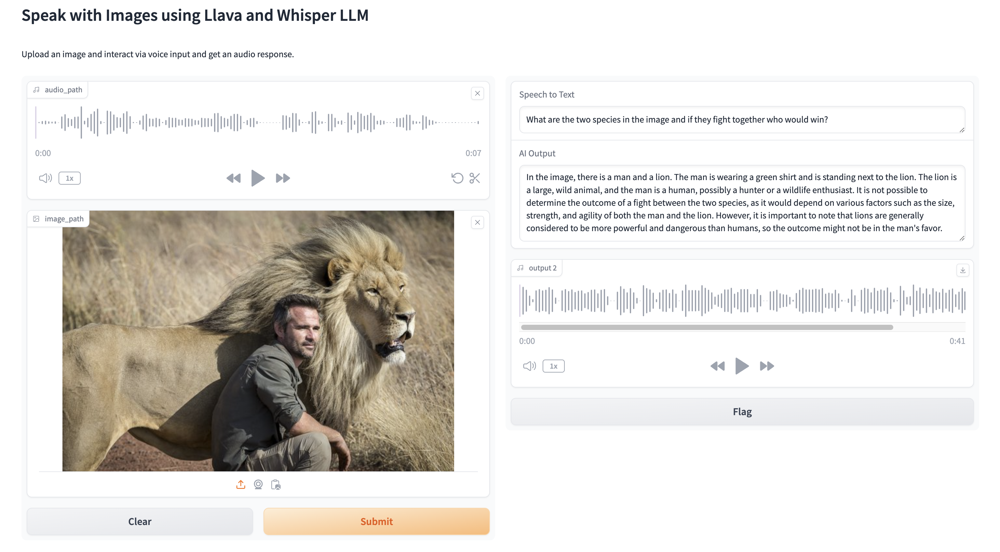

# Speech to speech Interactive Question Answering with Image

This project enables users to interact with images using audio input. Users can ask questions about an uploaded image, and the system will generate text-based responses using multimodal language models. 

The workflow involves:
1. Audio input: Users can record a question about the uploaded image using audio.
2. Speech-to-text conversion: The audio is converted to text using Whisper, OpenAI's speech-to-text model.
3. Question processing: The text input along with the image is processed using a multimodal language model like Llava.
4. Text-based response: The model generates a response to the question in text format.
5. Text-to-speech conversion: The text response is converted back to audio using the Google Text-to-Speech (gTTs) library.

## Usage
To use the project, follow these steps:
1. Clone the repository.
2. Open the provided Jupyter Notebook file.
3. Run all the cells sequentially.
4. Upload an image.
5. Click the audio button to record your question.
6. Wait for the system to generate the response.

## Demo

## Acknowledgements
This project utilizes the following libraries:
- [Gradio](https://github.com/gradio-app/gradio) - For creating the user interface.
- [Whisper](https://github.com/openai/whisper) - OpenAI's speech-to-text model.
- [Hugging Face Transformers](https://github.com/huggingface/transformers) - For loading the Llava model.
- [TensorFlow](https://www.tensorflow.org/) - Deep learning framework.
- [Google Text-to-Speech (gTTs)](https://pypi.org/project/gTTS/) - For text-to-speech conversion.

## License
This project is licensed under the [Apache License](LICENSE).

